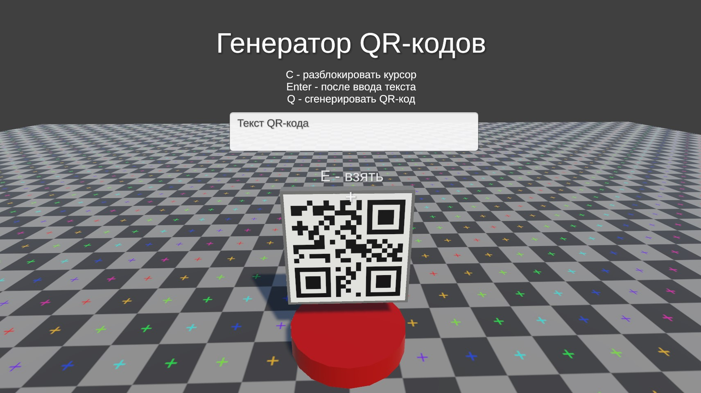
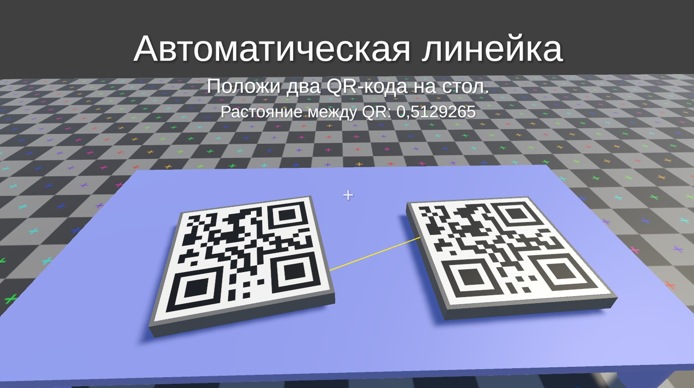

# QR-code  
Тестовое задание для программиста  
## Задание  
Сгенерировать два QR-кода, положить их на столе и померить через приложение Юнити расстояние между двумя QR.
## Описание  
Версия Unity 2022.3.21f1  
Управление: AWSD + QE + Мышка.  
## Видео геймплея  
[Видео на Яндек Диск](https://disk.yandex.ru/i/sNnLNm-kaF39fg)  
## Скриншоты  
  
  